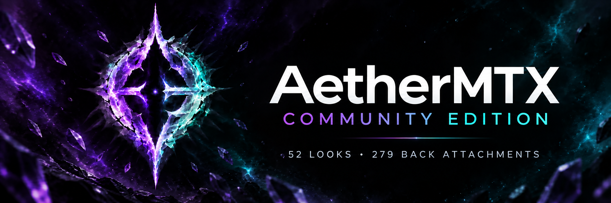
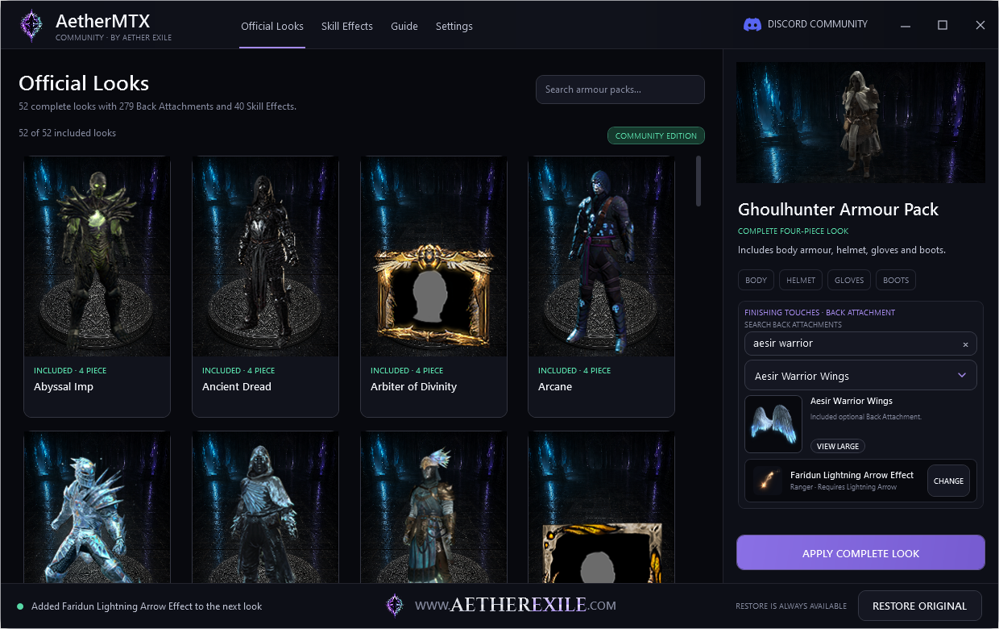
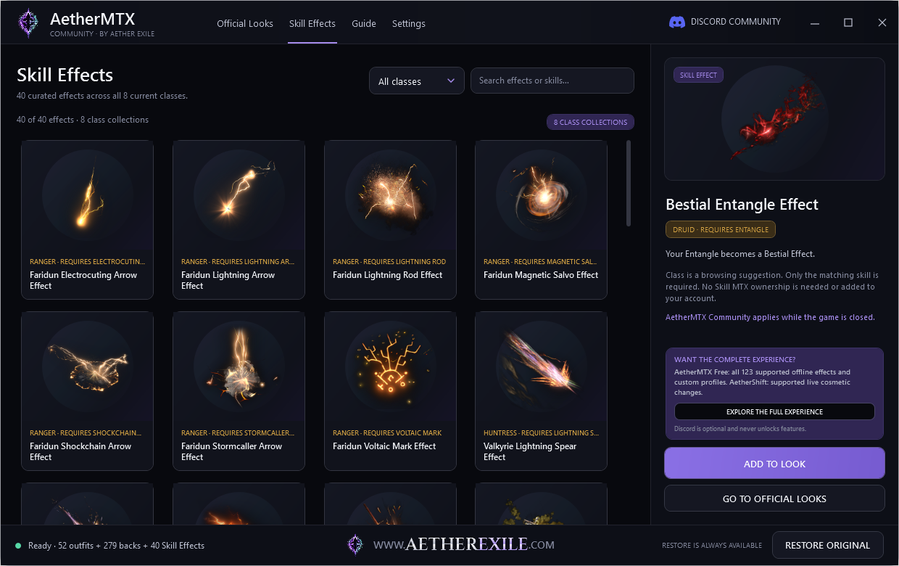
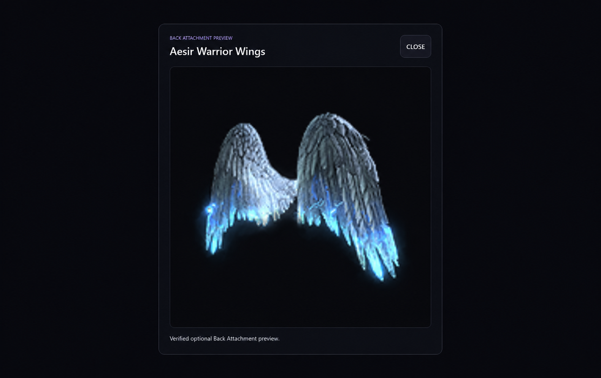

# 52 COMPLETE LOOKS · 279 BACK ATTACHMENTS · 40 SKILL EFFECTS

## FREE COMMUNITY EDITION

**Get builds, patch-status updates, showcases and support.** Discord is the main community hub, but it is not a technical requirement and never unlocks features.

**[DOWNLOAD VERSION 1.1.0](https://github.com/AetherExile/aethermtx-community/releases/download/v1.1.0/AetherMTX-Community-1.1.0.exe)** · [Release notes](https://github.com/AetherExile/aethermtx-community/releases/tag/v1.1.0) · [Official website](https://www.aetherexile.com)

| 52 COMPLETE LOOKS | 279 BACK ATTACHMENTS | 40 SKILL EFFECTS | 8 CLASS COLLECTIONS |
| --- | --- | --- | --- |
| GGG + STEAM | SEARCH AND PREVIEWS | RESTORE ORIGINAL | COMPLETELY FREE |

This is the official download and documentation repository for AetherMTX Community Edition. The application is free to use and distributed as a compiled Windows application. It is not open source.

Everything documented here refers specifically to Community Edition. Features and catalogues may differ between AetherMTX editions.

## Download and verify

The Windows x64 download is available from GitHub Releases. Always compare the downloaded file with the checksum published for that exact release. Release assets are never stored in the Git repository.

Current release:

| Field | Value |
| --- | --- |
| Version | `1.1.0` |
| File | `AetherMTX-Community-1.1.0.exe` |
| Size | `177703887` bytes |
| SHA-256 | `BBB1F1A48D5401B064FDBD0B9101830FF23D6876B5FE330802F52CAEB46F7D37` |
| Signature | Not signed |
| Platform | Windows x64 |
| Game distribution | GGG standalone and Steam |

## What Community Edition includes

- 52 complete Official Looks backed by 43 armour cores.
- 279 optional Back Attachments in the same Apply flow.
- 40 Skill Effects arranged into one curated collection for each current class.
- Search by effect, required skill or collection, plus class filters and exact local previews.
- One Skill Effect can be added to the selected complete look.
- Unlimited Apply and Restore Original controls.
- No account, login, license key, payment, subscription or Discord requirement.

A Skill Effect requires the matching skill. It does not add cosmetic ownership to an account. AetherMTX Community Edition supports both the standalone Grinding Gear Games client and Steam.

## Skill Effects

Version 1.1.0 adds 40 effects across Ranger, Huntress, Mercenary, Warrior, Monk, Witch, Sorceress and Druid.

## How it works

1. Install Path of Exile 2 through GGG or Steam.
2. Close Path of Exile 2 and its launcher.
3. Start AetherMTX Community Edition.
4. Select the GGG or Steam installation you want to use if it is not detected.
5. Choose an Official Look and, optionally, a Back Attachment.
6. Open Skill Effects and add one compatible effect if wanted.
7. Select Apply Complete Look and wait for it to finish.
8. Launch the game, or use Restore Original whenever you want to undo the selected combination.

Use a Community Edition release marked compatible with your current game version. Keep the application closed while the game is running, and close the game again before Apply or Restore.

## Continue with Aether Exile

Community Edition is permanently free and complete as documented above.

- **AetherMTX Free** contains the complete supported offline catalogue with all 123 Skill Effects and custom profiles.
- **AetherShift** provides supported live cosmetic changes.

[Join the optional Aether Exile community](https://discord.gg/KNd66FXtvw) to find both products, builds, showcases and support. Joining Discord never unlocks Community Edition features.

## See Community Edition

### Optional Back Attachment preview

## Download safety

Download only from this repository's Releases page and compare the SHA-256 with the value published for that exact version. Read [SECURITY.md](SECURITY.md) for reporting guidance.

## Important use risk

AetherMTX Community Edition is an independent third-party utility. It is not affiliated with, authorized by or endorsed by Grinding Gear Games.

The utility changes Path of Exile 2 game data. Tools that interact with the game or its files may violate the game's Terms of Use and may result in account action. Use is entirely at your own risk. This project does not claim to be safe, undetected or ban-proof.

Path of Exile and related names and assets are property of Grinding Gear Games. Product names may appear for identification and compatibility only.

## Help and community

- [Support guide](SUPPORT.md)
- [Frequently asked questions](FAQ.md)
- [Join the Aether Exile Discord](https://discord.gg/KNd66FXtvw)
- [Aether Exile website](https://www.aetherexile.com)

Discord is the fastest route for builds, patch-status updates, showcases and community support. Direct GitHub downloads remain available, and joining Discord does not unlock any feature.

## Repository scope

This repository contains release documentation, approved Aether Exile branding and selected product screenshots. The allowed tree is recorded in [PUBLIC-CONTENT-MANIFEST.md](PUBLIC-CONTENT-MANIFEST.md).

Application source is not distributed here. Release executables are attached to GitHub Releases rather than committed to the Git tree.
